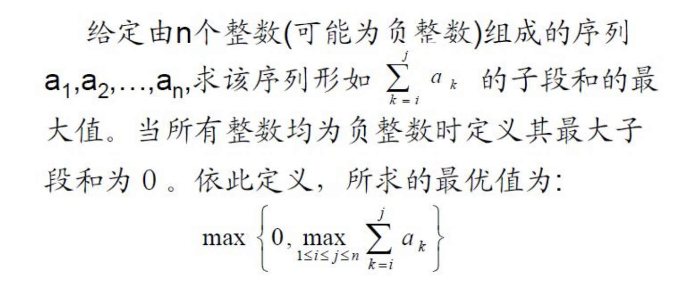
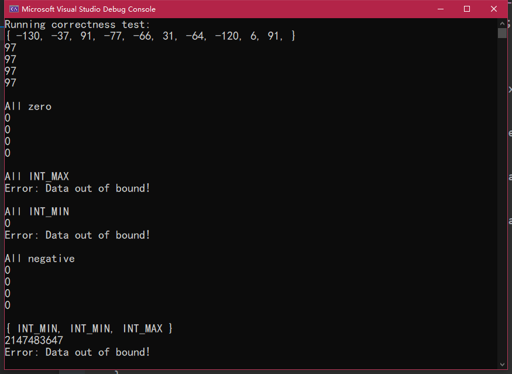
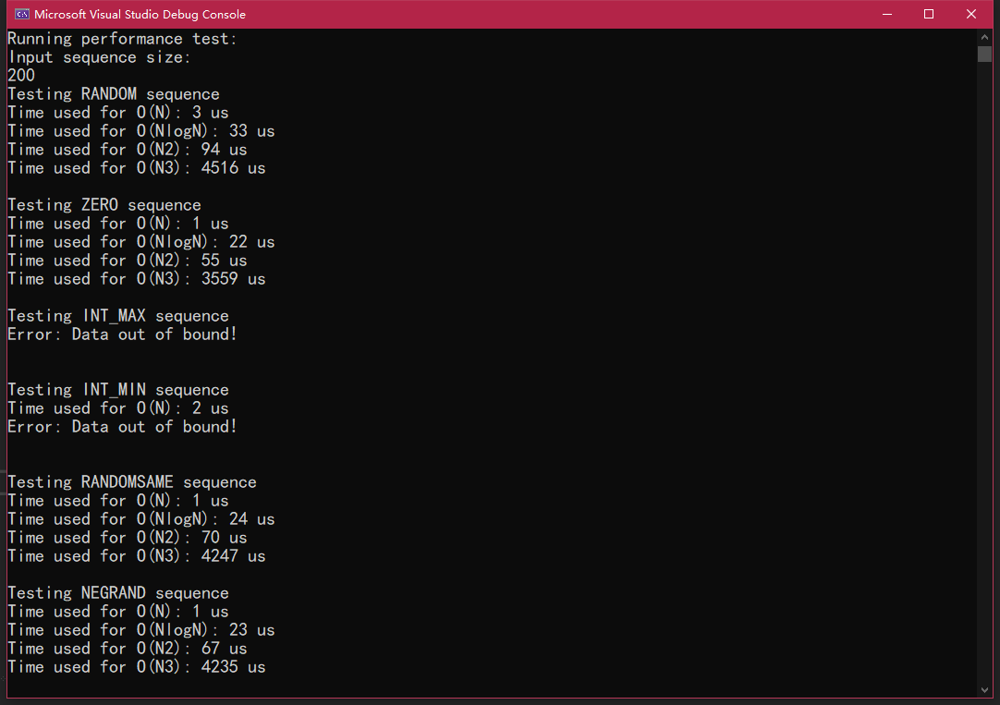
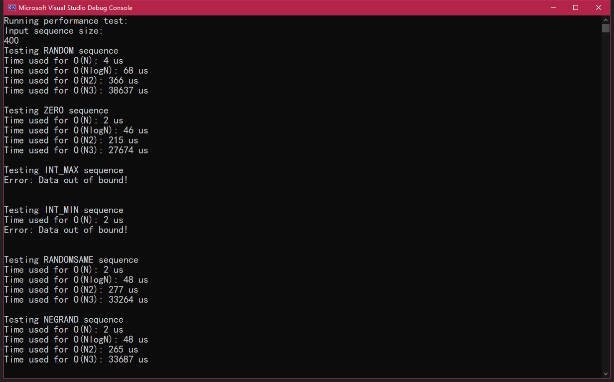
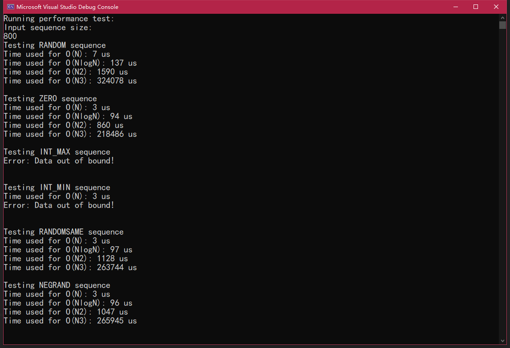
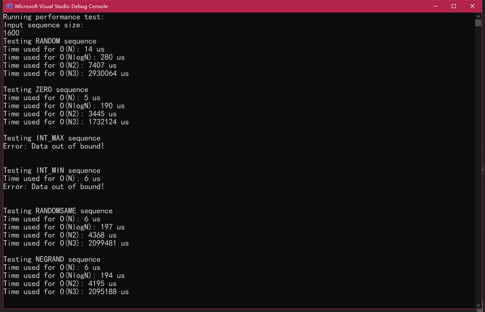

# 最大子段和算法实验报告

## 算法目的

求解最大子段和



## 算法分析

1. 枚举法

> 对于由n个整数组成的数组，枚举出从第0个、第1个、……、第n-1个元素开始的所有子数组，即可遍历该数组所有的子数组。同时维护一个最大值用于记录已经枚举过的子段和的最大值。遍历之后，最大值即为该数组的最大子段和。
>
> 时间复杂度：维护i和j两个旗标用于标识子段首位位置，同时k旗标用于累加i到j的各个整数。3层循环，
> ```
> T(N)=O(N^3)
> ```


2. 优化过的枚举法

> 因为方法1对于每个从i开始到j结束的子段都求出和，导致每次i到j+1的计算其实把i到j重新计算了一遍，严重降低了程序运行的效率。因此对于一个n个整数的数组，从i开始的子段，维护一个j旗标从i开始累加到n-1个元素，同时维护一个最大值记录从i累加到n-1过程中产生的最大子段和。
>
> 时间复杂度：相较于算法1，算法2减少了一层循环，维护i和j两个旗标，i用于标识子段首位位置，j旗标用于累加i到j的各个整数同时标识子段尾部位置。
>
> ```
> T(N)=O(N^2)
> ```

3. 分治法

> 从前两种方法的经验可知，求解最大子段和问题需要的时间会随着数组长度n的增长而指数级增长，所以对于一个规模为n的问题，如果能拆分成两个规模为n/2的问题，那么解决问题的时间将会显著缩短。分治法利用了递归的思想，将问题一分为二成两个子问题，再将两个子问题各分成两个子问题，以此类推，知道最后的问题可以被轻松解决（子段长度为1）。
>
> 时间复杂度：分治法每次将n个整数的问题划分成两个n/2个整数的子问题，但是为了保证两个子问题合并之后的结果是正确的，需要对原来的n个整数问题进行一遍扫描。
>
> ``` 
> T(N)=2T(N/2)+O(N)
> 递推得
> T(N)=(2^x)*T(N/2^x)+x*O(N) 因为递推最终规模为1，则有N=2^x，x=log(N)
> T(N)=N*T(1)+log(N)*O(N)
> T(N)=N+log(N)*O(N)
> T(N)=O(NlogN)
> ```

4.单次扫描算法

> 因为我们求解的问题是最大子段和，我们知道对于j-i个整数的子段，若第j+1个元素是非负数，那么j+1-i的子段和必然大于等于j-i子段。反之，若第j+1个元素是负数，那么j+1-i的子段和必然小于j-i子段，故其不是我们所需要的拥有最大子段和的子段。根据这个思路，我们其实只需要对数组扫描一遍：维护一个旗标i，同时维护变量当前值ThisSum和最大值MaxSum：MaxSum记录当前已经扫描过的最大子段和。初始状态下，ThisSum代表第0个元素到第i个元素的和。若i从0开始遇到的全为非负数，那么ThisSum的值与MaxSum的值相同，代表当前最大子段和就是i-0子段产生的。若遇到负数，那么将ThisSum归零，此后ThisSum的值表示从上一个非负元素到第i个元素的子段和。若ThisSum大于MaxSum，则更新MaxSum。
>
> 时间复杂度：只对数组扫描一次。
>
> ```
> T(N)=O(N)
> ```

## 算法源码

1. ``` c++
	int MaxSubsequenceSumN3(int A[], int N)
	{
		int ThisSum, MaxSum = 0;
		for (int i = 0; i < N; i++)
		{
			for (int j = i; j < N; j++)
			{
				ThisSum = 0;
				for (int k = i; k <= j; k++)
				{
					if ((A[k] > 0 && ThisSum + A[k] < ThisSum) || (A[k]<0 && ThisSum + A[k] > ThisSum))throw "Error: Data out of bound!\n";
					ThisSum += A[k];
				}
				if (ThisSum > MaxSum)
					MaxSum = ThisSum;
			}
		}
		return MaxSum;
	}
	```

2. ```c++
	int MaxSubsequenceSumN2(int A[], int N)
	{
		int ThisSum, MaxSum = 0;
		for (int i = 0; i < N; i++)
		{
			ThisSum = 0;
			for (int j = i; j < N; j++)
			{
				if ((A[j] > 0 && ThisSum + A[j] < ThisSum) || (A[j]<0 && ThisSum + A[j] > ThisSum))throw "Error: Data out of bound!\n";
				ThisSum += A[j];
				if (ThisSum > MaxSum)
					MaxSum = ThisSum;
			}
		}
		return MaxSum;
	}
	```

3. ```c++
	int DivideCountSubsequence(int A[], int left, int right)
	{
		int ThisSum, MaxSum = 0, mid = (left + right) / 2;
		//check termination condition
		if (left < right)
		{
			//split the problem
			int LeftMax = DivideCountSubsequence(A, left, mid);
			int RightMax = DivideCountSubsequence(A, mid + 1, right);
			int Mid2LeftMax = 0, Mid2RightMax = 0;
			//check if merged subsequence has MaxSum
			for (int i = mid, ThisSum = 0; i >= left; i--)
			{
				if ((A[i] > 0 && ThisSum + A[i] < ThisSum) || (A[i]<0 && ThisSum + A[i] > ThisSum))throw "Error: Data out of bound!\n";
				ThisSum += A[i];
				if (ThisSum >= Mid2LeftMax)
					Mid2LeftMax = ThisSum;
			}
			for (int i = mid + 1, ThisSum = 0; i <= right; i++)
			{
				if ((A[i] > 0 && ThisSum + A[i] < ThisSum) || (A[i]<0 && ThisSum + A[i] > ThisSum))throw "Error: Data out of bound!\n";
				ThisSum += A[i];
				if (ThisSum >= Mid2RightMax)
					Mid2RightMax = ThisSum;
			}
			if (Mid2LeftMax + Mid2RightMax < Mid2LeftMax)throw "Error: Data out of bound!\n";
			int MidMax = Mid2LeftMax + Mid2RightMax;
	
			if (LeftMax > RightMax)
			{
				if (LeftMax > MidMax)
					MaxSum = LeftMax;
				else
					MaxSum = MidMax;
			}
			else
			{
				if (RightMax > MidMax)
					MaxSum = RightMax;
				else
					MaxSum = MidMax;
			}
		}
		else if (left == right) return A[left];
		return MaxSum;
	}
	
	
	int MaxSubsequenceSumNlogN(int A[], int N)
	{
		return DivideCountSubsequence(A, 0, N - 1);//N for length, N-1 for last index
	}
	
	```

4. ```c++
	int MaxSubsequenceSumN(int A[], int N)
	{
		int ThisSum = 0, MaxSum = 0;
		for (int i = 0; i < N; i++)
		{
			if ((A[i] > 0 && ThisSum + A[i] < ThisSum) || (A[i]<0 && ThisSum + A[i] > ThisSum))throw "Error: Data out of bound!\n";
			ThisSum += A[i];
			if (ThisSum > MaxSum)
				MaxSum = ThisSum;
			else if (ThisSum < 0)
				ThisSum = 0;
		}
		return MaxSum;
	}
	```

## 测试代码

1. 测试包括正确性测试与性能测试。正确性测试使用一些数据测试算法的正确性与鲁棒性，性能测试输入一个较大的数组测试各种算法的运行速度。
2. 测试函数

```c++
//ListGen函数可以根据输入参数生成不同的数组：随机型、全零型、全最大值型、全最小值型等等
//ugly, but works.
void ListGen(int* List, int arg, int num, int range)
{
	switch (arg)
	{
	case 0:
	{
		srand(time(NULL));
		for (int i = 0; i < num; i++)
		{
			List[i] = (rand() % range - range / 2);
		}
		break;
	}
	case 1:
	{
		for (int i = 0; i < num; i++)
		{
			List[i] = 0;
		}
		break;
	}
	case 2:
	{
		for (int i = 0; i < num; i++)
		{
			List[i] = INT_MAX;
		}
		break;
	}
	case 3:
	{
		for (int i = 0; i < num; i++)
		{
			List[i] = INT_MIN;
		}
		break;
	}
	case 4:
	{
		srand(time(NULL));
		int value = rand() % range - range / 2;
		for (int i = 0; i < num; i++)
		{
			List[i] = value;
		}
		break;
	}
	case 5:
	{
		srand(time(NULL));
		int value = rand() % range - range;
		for (int i = 0; i < num; i++)
		{
			List[i] = value;
		}
		break;
	}
	}
}
```

```c++
//CorrectnessTest测试算法正确性。使用了普通数组、和全INT_MAX、全INT_MIN、全0等特殊数组。
void correctnessTest()
{
	cout << "Running correctness test:" << endl;
	int size = 10;
	try {
		int* A = new int[size];
		ListGen(A, 0, size, 300);
		cout << "{ ";
		for (int i = 0; i < size; i++)
			cout << A[i] << ", ";
		cout << "}" << endl;

		cout << MaxSubsequenceSumN(A, size) << endl;
		cout << MaxSubsequenceSumNlogN(A, size) << endl;
		cout << MaxSubsequenceSumN2(A, size) << endl;
		cout << MaxSubsequenceSumN3(A, size) << endl;
		cout << endl;
	}
	catch (const char* msg) {
		cerr << msg << endl;
	}

	int* B = new int[size];

	try {
		cout << "All zero" << endl;
		ListGen(B, 1, size, 100);
		cout << MaxSubsequenceSumN(B, size) << endl;
		cout << MaxSubsequenceSumNlogN(B, size) << endl;
		cout << MaxSubsequenceSumN2(B, size) << endl;
		cout << MaxSubsequenceSumN3(B, size) << endl;
		cout << endl;
	}
	catch (const char* msg) {
		cerr << msg << endl;
	}

	try {
		cout << "All INT_MAX" << endl;
		ListGen(B, 2, size, 100);
		cout << MaxSubsequenceSumN(B, size) << endl;
		cout << MaxSubsequenceSumNlogN(B, size) << endl;
		cout << MaxSubsequenceSumN2(B, size) << endl;
		cout << MaxSubsequenceSumN3(B, size) << endl;
		cout << endl;
	}
	catch (const char* msg) {
		cerr << msg << endl;
	}

	try {
		cout << "All INT_MIN" << endl;
		ListGen(B, 3, size, 100);
		cout << MaxSubsequenceSumN(B, size) << endl;
		cout << MaxSubsequenceSumNlogN(B, size) << endl;
		cout << MaxSubsequenceSumN2(B, size) << endl;
		cout << MaxSubsequenceSumN3(B, size) << endl;
		cout << endl;
	}
	catch (const char* msg) {
		cerr << msg << endl;
	}

	try {
		cout << "All negative" << endl;
		ListGen(B, 5, size, 100);
		//B[0] = 1; B[1] = -1; B[2] = 2; B[3] = -1; B[4] = 2;
		cout << MaxSubsequenceSumN(B, size) << endl;
		cout << MaxSubsequenceSumNlogN(B, size) << endl;
		cout << MaxSubsequenceSumN2(B, size) << endl;
		cout << MaxSubsequenceSumN3(B, size) << endl;
		cout << endl;
	}
	catch (const char* msg) {
		cerr << msg << endl;
	}


	try {
		cout << "{ INT_MIN, INT_MIN, INT_MAX }" << endl;
		int C[] = { INT_MIN, INT_MIN, INT_MAX };
		cout << MaxSubsequenceSumN(C, 3) << endl;
		cout << MaxSubsequenceSumNlogN(C, 3) << endl;
		cout << MaxSubsequenceSumN2(C, 3) << endl;
		cout << MaxSubsequenceSumN3(C, 3) << endl;
		cout << endl;
	}
	catch (const char* msg) {
		cerr << msg << endl;
	}
}
```

```c++
//性能测试部分，CountTime函数和perfTest函数
/*
头文件部分：利用C++11的新特性定义一个std::function对象，封装函数实体形成一个新的可调用的对象，使得函数可以使用函数作为参数。
*/
typedef std::function<int(int*, int)> testFunc;
//将函数传进CountTime函数，这里计时为了精确到微秒，使用了微软的profileapi.h，故跨平台兼容性不佳。应该用C++自带的chrono比较好
long long CountTime(testFunc func, int* array, int N)
{
	LARGE_INTEGER StartingTime, EndingTime, ElapsedMicroseconds;
	LARGE_INTEGER Frequency;

	QueryPerformanceFrequency(&Frequency);
	QueryPerformanceCounter(&StartingTime);

	// Activity to be timed
	func(array, N);

	QueryPerformanceCounter(&EndingTime);
	ElapsedMicroseconds.QuadPart = EndingTime.QuadPart - StartingTime.QuadPart;

	ElapsedMicroseconds.QuadPart *= 1000000;
	ElapsedMicroseconds.QuadPart /= Frequency.QuadPart;

	return ElapsedMicroseconds.QuadPart;
}

void perfTest()
{
	int size;
	cout << "\nRunning performance test:" << endl;
	cout << "Input sequence size:" << endl;
	cin >> size;
	int* A = new int[size];

	//test rand
	for (int i = 0; i < 6; i++)
	{
		ListGen(A, i, size, 1000);
		switch (i)
		{
		case 0:cout << "Testing RANDOM sequence\n"; break;
		case 1:cout << "Testing ZERO sequence\n"; break;
		case 2:cout << "Testing INT_MAX sequence\n"; break;
		case 3:cout << "Testing INT_MIN sequence\n"; break;
		case 4:cout << "Testing RANDOMSAME sequence\n"; break;
		case 5:cout << "Testing NEGRAND sequence\n"; break;
		}
		try {
			cout << "Time used for O(N): " << CountTime(MaxSubsequenceSumN, A, size) << " us" << endl;
			cout << "Time used for O(NlogN): " << CountTime(MaxSubsequenceSumNlogN, A, size) << " us" << endl;
			cout << "Time used for O(N2): " << CountTime(MaxSubsequenceSumN2, A, size) << " us" << endl;
			cout << "Time used for O(N3): " << CountTime(MaxSubsequenceSumN3, A, size) << " us" << endl;
		}
		catch (const char* msg) {
			cerr << msg << endl;
		}
	}
}
```

```c++
int main()
{
	correctnessTest();
	perfTest();
	return 0;
}
```

## 运行结果

### 正确性测试：



### 性能测试：

n=200：



n=400：



n=800：



n=1600：



## 小结

通过正确性测试可以得出，四种算法均能输出正确的结果，并且对于超出范围的数据能正确抛出异常。值得注意的是，在 All INT_MIN 和 { INT_MIN, INT_MIN, INT_MAX } 测试中，O(N)算法能够给出答案，其余三种算法会抛出异常。这是因为O(N)算法在遇到负数数据时会直接将其抛弃，而其余三种算法均会将其累加到一个int类型的ThisSum中，导致ThisSum数值超出int范围而报错。这是由算法的逻辑决定的，不是bug，是feature（（（

通过性能测试可以得出，各个算法的时间复杂度和理论分析相符。在处理大量数据时，低复杂度的算法可以极为显著地提升效率。